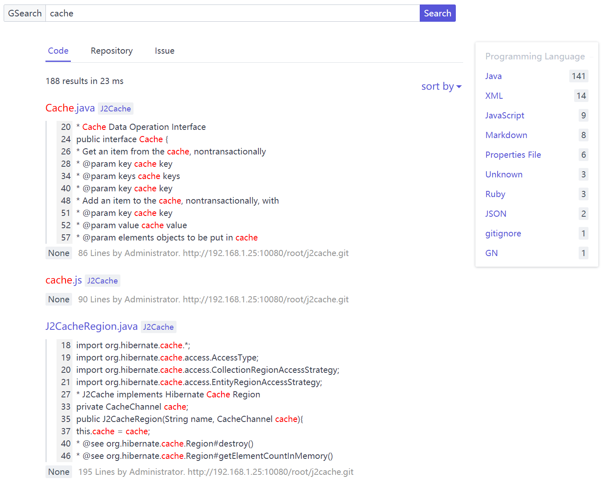
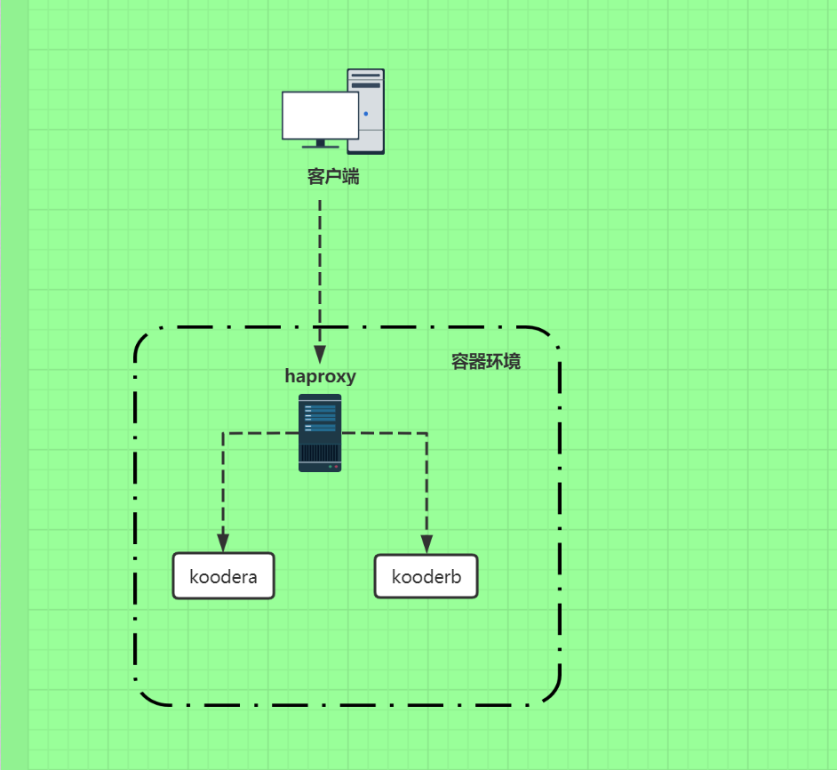
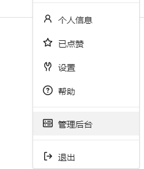
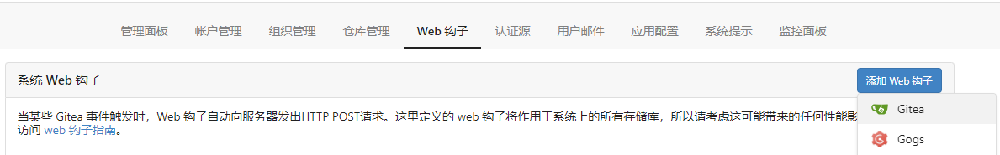
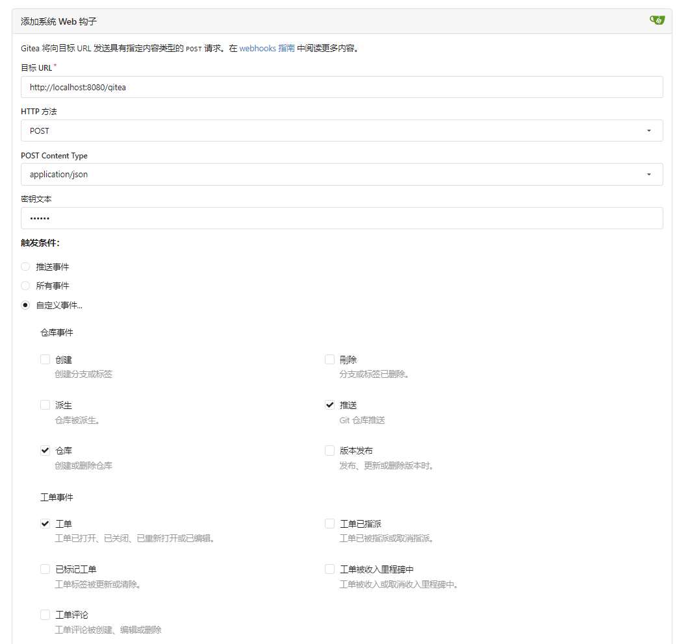

## Kooder

### Intro

Kooder is a open source code search project, offering code, repositories and issues search service for code hosting platforms including Gitee, GitLab and Gitea.


**UI**



There are two modules, gateway and indexer. Gateway is integrated inside gateway under default config.

Gateway:
- Accept index tasks from HTTP requests and put them in the queue after examing it
- Accept search requests and return their results back to the client

Indexer:
- Monitor the index tasks inside the queue
- Update these add, delete and update index tasks back to the index library

### Modules

* `core`    Core object and public class
* `gateway` Accept index and search requests from HTTP requests
* `indexer` A service to construct, update and delete index

### Logic Flow


### Install source code

1.Dependencies

* openjdk >= 8
* maven > 3

2.Download source code

```
$ git clone https://gitee.com/koode/kooder.git
$ cd kooder
```

### Configuration

Config file: `core/src/main/resources/kooder.properties`

Config kooder's url `http.url`. It will be injected into Git service as the webhook URL, must be accessible for Git service, such as:

```
http.url = http://<kooder-host>:8080
```
Click here to see more config options [configuration.md](docs/configuration.md)

### Install Docker
Dependencies
* docker-ce environment
* docker-compose

After cloning this repo, in a machine with docker compose installed, run the following command:


```
### Run containers in the background
docker-compose up -d 

### Stop and remove containers
docker-compose down
```

This is how it will look like：



After modifing the config file `/deploy/kooder.properties`, run the following commands; delete local kooder image and rebuid it.

```
docker rmi imageID
docker-compose up -d
```


**Use it in Gitlab**

Config following properties：

```
gitlab.url = http://gitlab-host:gitlab-port/  
gitlab.personal_access_token = <root user personal access token>  
git.username = root  
git.password =  
```

Kooder will use access token as the password if you don't offer one.

**Use it in Gitee**

Config following properties：

```
gitee.url = https://gitee.com/  
gitee.personal_access_token = <root user personal access token>  
git.username = root  
git.password =  
```

Kooder will use access token as the password if you don't offer one.

**Use it in Gitea**

1.Site Administration



2.Add Gitea Webhook



3.Set up Webhook

* Set Target URL to  `http://ip:port/gitea`
* Set POST Content Type to `POST + application/json`
* Check`All Event` or `Custom Events` for the `Trigger On` option. ( If you choose `Custom Events`, you need to check `Repo`, `Push` and `Issue`)




2.Config following properties.

```
gitea.secret_token = <webhook secret token>
gitea.url = http://gitea-ip:prot/
gitea.personal_access_token = <admin user personal access token>
git.username = <admin username>
git.password = <admin password>
```


**Build and Run**

```
$ cd Kooder
$ mvn install
### Run gateway
$ bin/gateway.sh
### Brower visits http://localhost:8080
```

