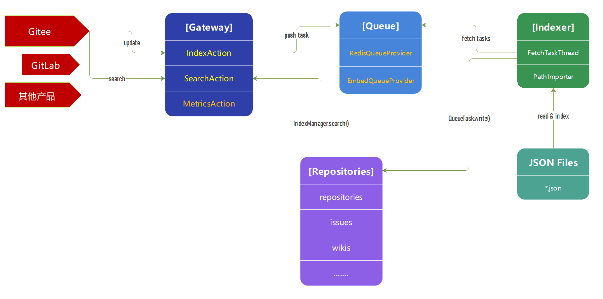

## Gitee Search

### 简介

Gitee Search 是 Gitee 的搜索引擎服务模块，为 Gitee/GitLab 提供仓库、Issue、代码等搜索服务。

整个 Gitee Search 服务包含两个进程，分别是 gateway 和 indexer（默认配置下 indexer 被集成到 gateway 中）。
其中 gateway 用来接受来自 HTTP 的索引任务， 对任务进行检查后存放到队列中；
同时 gateway 还接受搜索的请求，并返回搜索结果给客户端。而 indexer 进程负责监控队列中的索引任务，
并将这些要新增、删除和修改索引的任务更新到索引库中。

### 模块说明

* `core`    核心对象和公共类
* `gateway` 用来接收来自 HTTP 的索引和搜索的请求
* `indexer` 构建、更新和删除索引的服务

### 数据流图



### 安装

1.依赖

* openjdk >= 11
* maven > 3

2.构建并运行

```
$ git clone https://gitee.com/oschina/gitee-search.git
$ cd gitee-search
$ mvn install
### 启动 gateway
$ bin/gateway.sh
### 浏览器访问 http://localhost:8080
```

### 配置

详情请看 [configuration.md](configuration.md)

### 索引

安装完的 Gitee Search 不包含任何索引数据，
