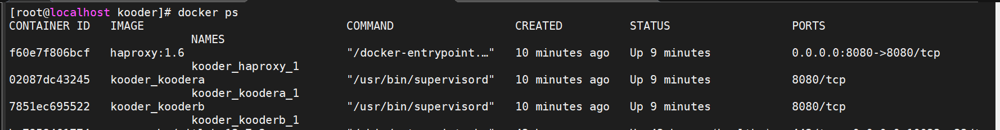

## Kooder

### 简介

Kooder 是一个开源的代码搜索服务，目标是为包括 Gitee/GitLab/Gitea 在内的代码托管系统提供代码、仓库和 Issue 的搜索服务。

Kooder 服务包含两个模块，分别是 gateway 和 indexer（默认配置下 indexer 被集成到 gateway 中）。
其中 gateway 用来接受来自 HTTP 的索引任务， 对任务进行检查后存放到队列中；
同时 gateway 还接受搜索的请求，并返回搜索结果给客户端。而 indexer 进程负责监控队列中的索引任务，
并将这些要新增、删除和修改索引的任务更新到索引库中。

### 模块说明

* `core`    核心对象和公共类
* `gateway` 用来接收来自 HTTP 的索引和搜索的请求
* `indexer` 构建、更新和删除索引的服务

### 数据流图


### 源码安装

1.依赖

* openjdk >= 11
* maven > 3

2.下载代码

```
$ git clone https://gitee.com/koode/kooder.git
$ cd kooder
```

### 运行前准备工作

配置文件: `core/src/resource/kooder.properties`

配置 Kooder 的网址 `http.url` ，该地址用于向 Git 服务注入 Webhook 的链接地址，
必须是 Git 服务可访问的地址，例如：

```
http.url = http://<kooder-host>:8080
```

更多配置项请看 [configuration.md](configuration.md)

### Docker安装
依赖
* docker-ce环境
* docker-compose

开发代码优化后，部署只需将代码clone下来，然后在服务器上部署容器平台，在平台上执行如下命令：
```
docker-compose up -d
```



实现的效果如下：


配置文件：`/deploy/kooder.properties`,修改配置文件之后，执行如下命令；
删除本地kooder镜像，重新build镜像。
```
docker rmi imageID
docker-compose up -d
```


**对接 Gitlab**

需配置如下几项：

```
gitlab.url = http://gitlab-host:gitlab-port/  
gitlab.personal_access_token = <root user personal access token>  
git.username = root  
git.password =  
```

如果不填写密码，则 Kooder 会自动使用 access token 作为密码。

**对接 Gitee**

需配置如下几项：

```
gitee.url = https://gitee.com/  
gitee.personal_access_token = <root user personal access token>  
git.username = root  
git.password =  
```

如果不填写密码，则 Kooder 会自动使用 access token 作为密码。


**构建并运行**

```
$ cd Kooder
$ mvn install
### 启动 gateway
$ bin/gateway.sh
### 浏览器访问 http://localhost:8080
```

**搜索界面效果**

